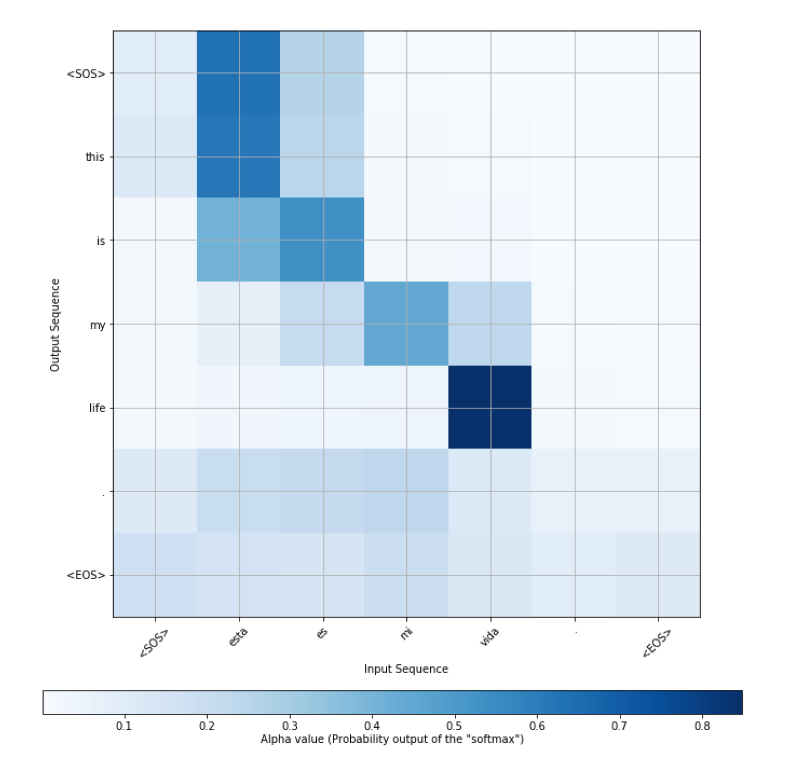
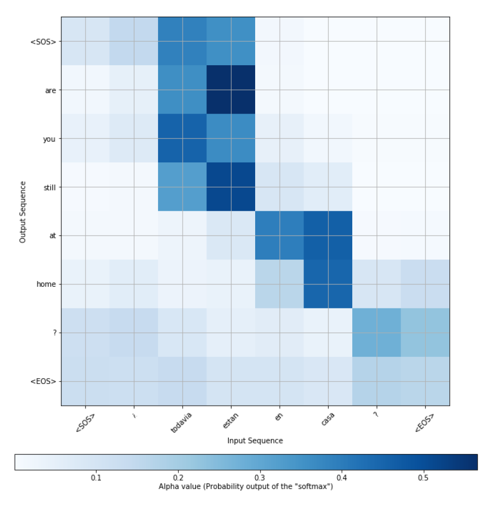

# Spanish2English

## Model 

Implementation of Neural Machine Translation from Spanish to English 

Model: Encoder and Decoder model with Attention

## Dataset 

Dataset: tf.keras.utils.get_file('spa-eng.zip', origin = 'http://download.tensorflow.org/data/spa-eng.zip',extract = True)

## Training 

How to train model in Google Colaboratory 

Step 1: upload downloaded folder to Google Drive

step 2: open Colaboratory and do not forget to change running type to GPU

Step 3: mount your google drive to Colaboratory

--run

from google.colab import drive

drive.mount('/content/gdrive')

Step 4: copy train.py in the running block

Step 5: run code

## Prediction

step 6: download trained model from Colaboratory 

step 7: run predict.py

